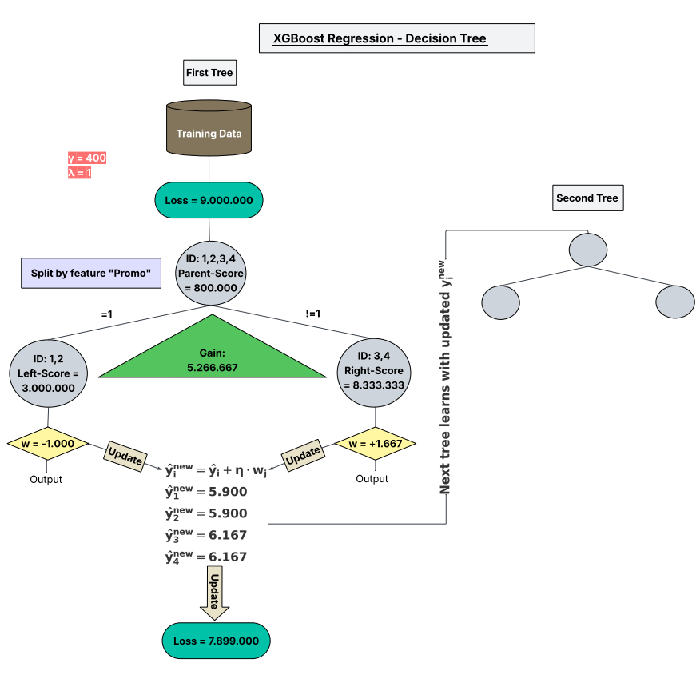

# XGBoost_Regression_Explained_Step_by_Step

---

## 🔵**How does it work?**

Here is a simplified overview of the 12 key steps we go through:

1. **Loss Function**  
   Define how the model measures error (e.g., Mean Squared Error for regression tasks).

2. **Gradient & Hessian**  
   Calculate the 1st and 2nd derivatives of the loss function — they guide the tree building process.

3. **Sample Data (Rossmann)**  
   Use a small sample from the dataset to demonstrate how XGBoost works.

4. **Taylor Approximation**  
   Approximate the loss function using a second-order formula (for better optimization).

5. **Gain Calculation & First Split**  
   Choose the best feature and threshold to split the data and reduce the loss.

6. **Second Split (Left Subtree)**  
   Try to split the left branch further, if it improves the model.

7. **Second Split (Right Subtree)**  
   Same for the right side — check if further splitting is useful.

8. **Compute Leaf Outputs**  
   Each leaf gets a score (prediction value) that minimizes the local loss.

9. **Update Predictions**  
   Adjust the original prediction using the tree output and the learning rate.

10. **New Loss After First Tree**  
    Recalculate total loss and compare it to the previous step.

11. **Pass to the Next Tree**  
    The model builds a new tree to fix the remaining error.

12. **Load Test Data**  
    Finally, we feed the real cleaned test data into the model to begin training.

---

## 📘 Full PDF Guide

👉 [Download the full explanation (PDF)](./XGBoost_Regression_Explained_Step_by_Step/XGBoost_Regression_Explained_Step_by_Step.pdf)

---

## 🌳 Visual Example – First Tree in XGBoost

This tree may not be perfect, but it illustrates how XGBoost makes splitting decisions based on gain, gradients, and Hessians:

---

## 🔍 Why this project?

I wanted to deeply understand how **XGBoost Regression** works – not just use it as a black box.  
This guide helped me visualize every step and gain real intuition.

---

## 🧠 Keywords

`XGBoost`, `Regression`, `Gradient Boosting`, `Machine Learning`, `Explainable AI`, `SHAP`, `Learning Rate`, `Gain`, `Decision Tree`, `Python`
